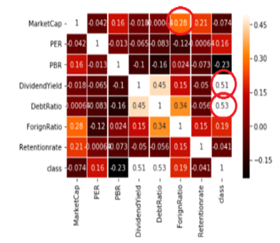

## 주식 다중분류기 - 1인 Toy 프로젝트
파이썬 언어와 Keras 라이브러리를  이용해서 주식 개별종목을 Multi Classfy하는 학습목적의 Toy 프로젝트입니다.

1. 성장주
2. 가치주
3. 배당주
4. 투자유의주

영웅문 HTS에서 제공된 주식분류 내용을 참고하여 위 분류의 Training Set, Validation Set을 구성하였습니다.  

크롤링을 통해 알고싶은 종목명의 금융정보를 검색하여 학습된 인공지능 모델이 위 4개의 분류 중 어떤 분류의 주식에 제일 가까운 지, 다중분류를 실행합니다.
## 1. 개발환경
<blockquote> 

 언어

</blockquote>
<ul>
<li>Python 3.6</li>
</ul>
<blockquote> 

 프레임워크 & 라이브러리

</blockquote>
<ul>
<li>Keras : 오픈 소스 신경망 라이브러리</li>
<li>BeautifulSoup : HTML 데이터 parsing 라이브러리</li>
<li>Matplotlib : 시각화 라이브러리</li>
<li>PyQt5 : GUI 개발 프레임워크 </li>
</ul>
<blockquote> 

 IDE

</blockquote>
<ul>
<li>Pycharm</li>
</ul>

## 2. 패키지 구조

AvgGraph.py : 그래프 생성 클래스 
FinClawer.py : 네이버 금융정보 크롤링 클래스 
FinLearning.py : 인공지능 다중분류 클래스
StockStorterMain.py : GUI 생성을 담당하고 Main메소드가 존재하는 클래스

DeeplearningModel 폴더 : 학습데이터, 테스트데이터, 학습된 모델 존재

## 3. 데이터 분석

영웅문HTS에서 제공한 주식 분류별 포트폴리오 데이터를 활용하였습니다.

부채비율, 시가 배당률, 시가총액 세 값에서 유의미한 결과를 내는 것을 시각화 분석으로 확인하였습니다.

데이터 전처리과정으로서 주식 이름, 주식 코드, 현재값과 같이 영향을 전혀 주지 않는 데이터 칼럼은 삭제하였습니다.

## 4.  주요 기능

### 4-1.  종목 크롤링 & 종목 평균치 그래프 비교

### 4-2.  주식 다중분류

